# Blog Post: Pet Match **_[GitHub Repo](https://github.com/TechLabs-Berlin/wt21-pet-match.git)_** #

## Table of contents ##

1. [Team Members](#team-members "Goto team-members")

2. [Front-end](#front-end "Goto front-end")

3. [Back-end](#back-end "Goto back-end")

4. [Data Science](#data-science "Goto data-science")

## Team Members ##

- Andrea Martins (WD-FE)

- Oksana Maistat (DS)

- Andre Hoppe (WD-BE)

- Hany Elhassany (DS)

- Brigitta Röck (WD-FE)

- Nick Schnar (DS)

- Adedayo Adepegba (DS)

- Chanida (WD-BE)

## Front-end ##

### Tech-stack ###

- Figma, Canva, Visual Code Studio
- HTML, CSS, Javascript
- React (Router, Hooks), Axios

As we lost UX team early in the project, the WD-FE team decided to go on and design the layout on Figma. Since Andrea has a personal interest in Graphic Design and UX, she started with the development in Figma.

For this reason we divided up our tasks as follows: Andrea worked on Figma layouts, HTML pages and CSS, and Brigitta on React project, Javascript coding and coordination with WD-BE.

As we as a team faced a time problem, we decided not to use any additional UI library or other tools we were not familiar with.

Immediately after winter break, we had a meeting with the whole team to review Andrea's Figma layouts and decided to start implementing the front-end based on these layouts, even though not all pages had been created yet.

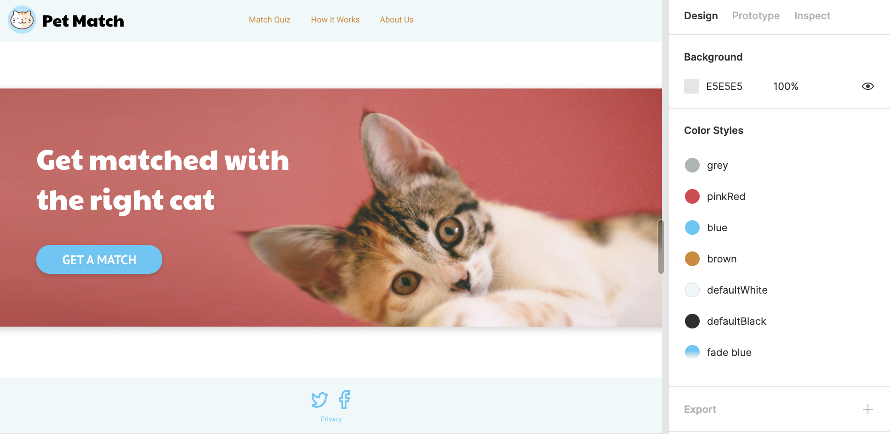

Andrea was now faced with the challenging task of having to alternate the design tasks and the implementation of the static HTML pages and CSS.

As of mid-January, we had additional support from 2 UX techies (Leticia and Siracha) from other teams who had already largely completed their tasks in their own teams. This was a great help for us, and we could finalize our layout.

Brigitta set up the front-end part of our project with React Router. At the beginning, the biggest challenge was to find out how the React system works and how the functionalities from our project would be implementable with it. This involved a lot of trial and error work.

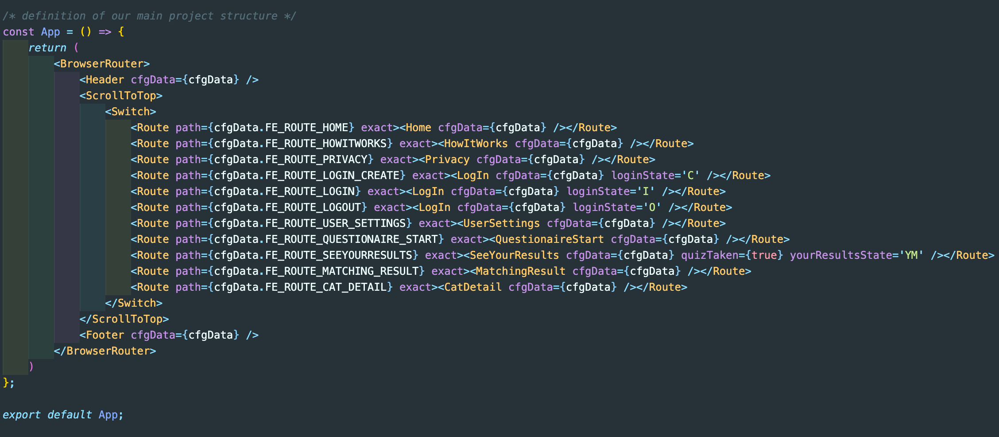

Below you can see our way from a Figma layout to a dynamic generated web page with React Router. As an example page, we use a page from the questionnaire for potential adopters:

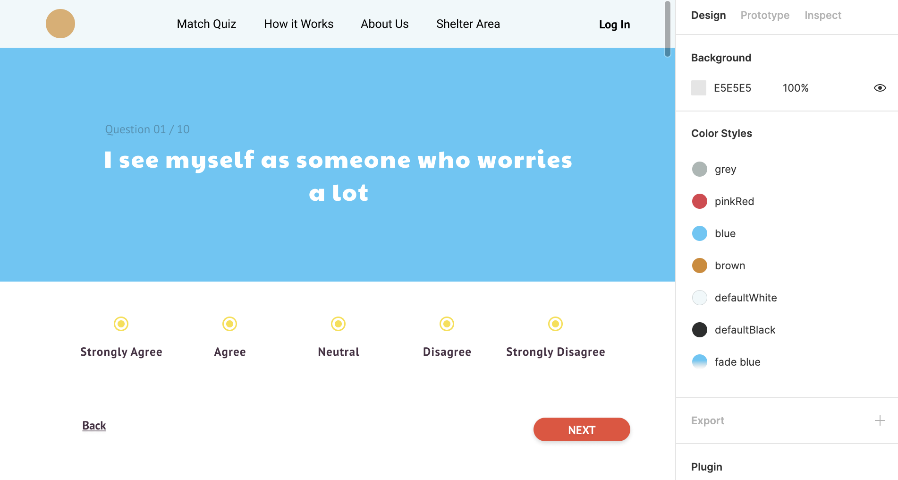

One of the main parts of the React project was to implement a dynamically generated page showing up the whole questionnaire for adopters. In order to remain as flexible as possible in the number of questions and possible answers, we decided to store them in a database. Together with the team WD-BE we decided to use mongoDB Atlas.

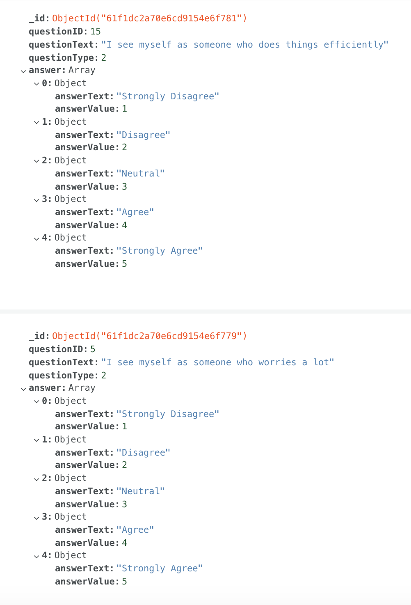

The screenshots below show the path from a static HTML page to the associated components in React:

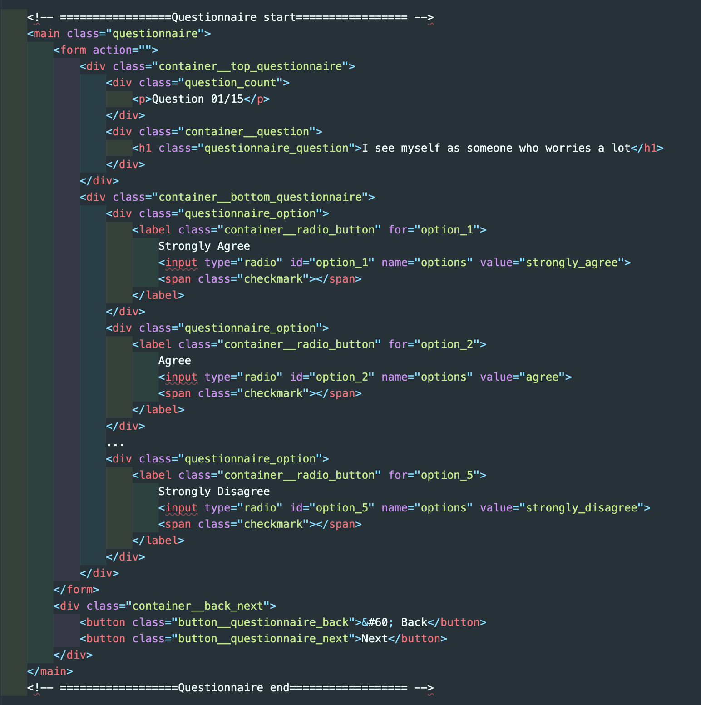

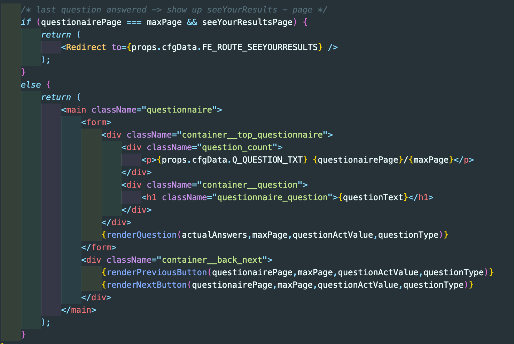

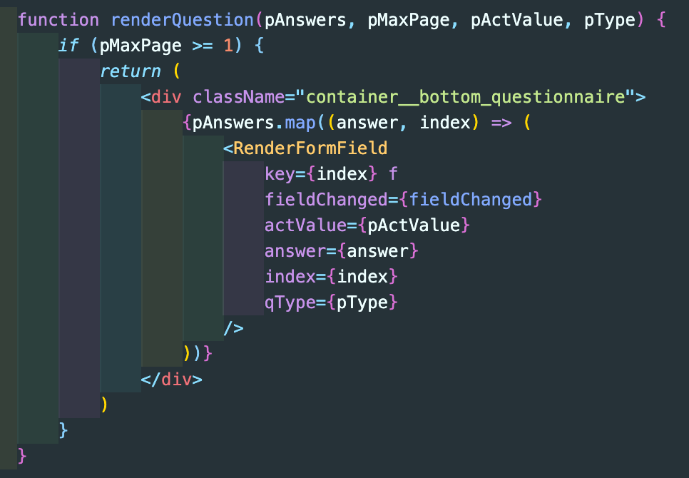

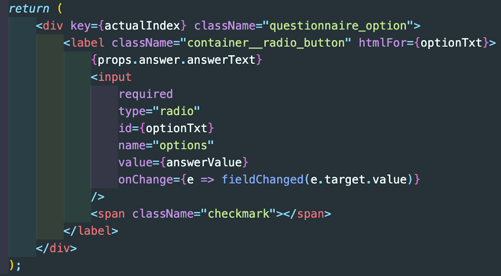

We read out the whole questionnaire from the database and store all questions in a JS array and present them to the user as separate pages each. The user can navigate back and forth between the pages, for example if they to correct their answers. All answers then are stored in a JS array as well. For this purpose we use Hooks (useState, useEffect).

After the last question, the array with all answers is passed to the back-end. Back-end routes are invoked either via Axios HTTP request or mongoose functionality.

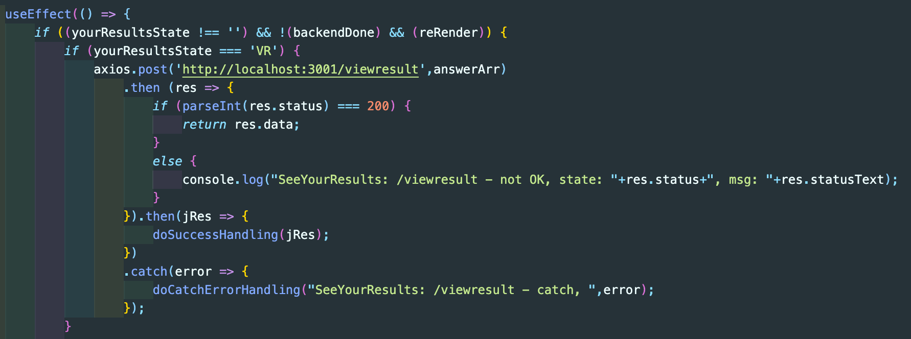

After asking the Data Science API to apply the matching algorithm to the user’s answers, back-end sends back the 10 best cat matches to the front-end. In front-end, the user is redirected to the Matching Results page, showing up previews of the selected cats. For this functionality we use the React component Redirect and pass the list of selected cats as a state variable. On the Matching Result page the state variable is read out with the React component *useLocation*.

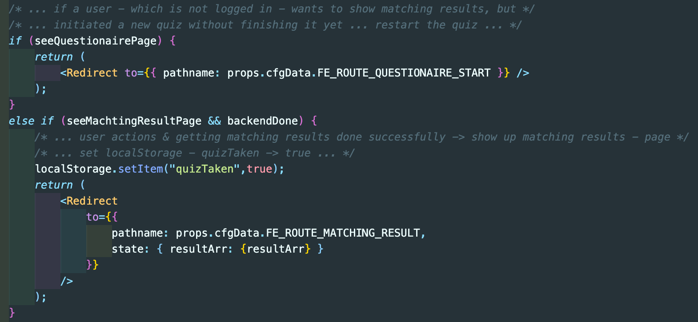

On the Matching Results page the cats are presented in a sorted order, best matches first. The user is then able to click on the cats' cards and go to the corresponding cat profile.

All cat images are stored on a file system in the public folder of our website.

### Additional functionality of our project: ###

- User can sign up / login.
- User can rewatch his matches, as his answers to the questionnaire are stored in his profile, and re-take the quiz.
- Matching results page includes filter functionality.

### Open Points: ###

- CSS integration into React project is incomplete.
- Cleanup functionality for useEffect is missing.
- User friendliness of our forms could be improved.
- There are some warning messages when compiling the project that we could not solve, so far.
- And, last but not least, with the knowledge of today, we would implement the React project differently than how we have done it.

## Back-end ##

As back-end developers we were responsible for the server-side logic of web applications, connection of endpoints, routing, setup of a database, connection to APIs, integration of other tracks code and retrieving, updating, storing data. We were also in charge of testing and debugging the server-side code and check if everything is working.

The top three tools we have used the most are listed below:

\#1 Visual Studio Code

To read, create and edit the source code for our project we used the code editor Visual Studio Code from Microsoft. The reasons why we used Visual Studio Code are that the software is for free, it runs on different operating systems, it has a huge variety of helpful extensions and most of the tutorials and learnings we checked used Visual Studio Code as code editor. In addition, Visual Studio Code has a good working and easy to understand interactive debugging console which helps to identify errors or mistakes in the code to correct them.

\#2 Postman

Postman is a platform of several tools like design, test, mock, monitor and document to accelerate the work with APIs. We used Postman mainly to check if responses of requests to our server are returning the right information we need for our project.

\#3 MongoDB Atlas

To check and store our results and information we used the multi-cloud database called MongoDB Atlas. That database supports all MongoDB features, supports JSON files and schema, has a live migration and can be used and accessed by several people.

To fulfill the project requirements addressed to the backend track we worked with different libraries as you can see in screenshot “libraries” and used the programming language Java Script.

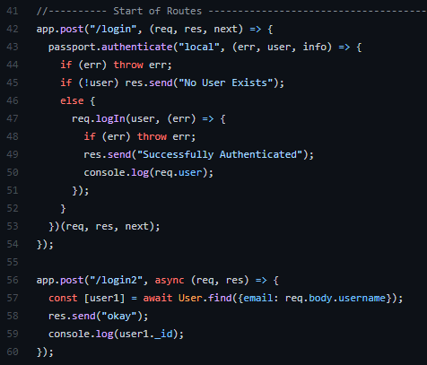

Before we started coding, we needed to draw the wireframe of the website and the server-side logic behind to get a basic understanding what kind of code and data we need to provide to the frontend team and what we need to receive from the other tracks to make our project code work. Hence a lot of meetings and coordination between the frontend and backend team took place.

After setting up the server and installation of the libraries we created a login with registration. For us it was not so easy to know which route to create and how to retrieve the user ID after the login. After quite a few attempts to make the code work we decided to create a normal login which is just checking the username and password and a login after taking the quiz which we need to process the users answers as you can see in the picture “Login”.

We decided to create user accounts for “non-users” in our database but without saving their email and password information. The idea was to use the objectID as a “user-ID” for identification when we save the users answers in our database. Another obstacle was that we were not able to create a user with “null” as email value after the second try. The reason was that we set the email as unique in our user schema and when we have the “null” value for the email more than one time in the database the code is translating it as a duplicate value. We solved that issue by adding another parameter called “sparse” to the user schema which allows us to have duplicate null value for email. We also needed to coordinate, discuss and think about which information should be part of the user schema which you can see in the picture “User schema”.

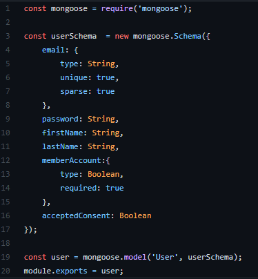

For the answers and the match quiz we also created schemas. While coding and seeing the project grow, we realized that we need more routes, and the possibilities of options and outcomes also became more as you can see in the extract of our working file “Route ideas”.

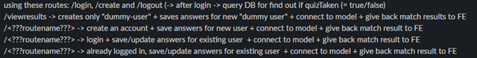

Beside a lot of trials and errors and moments of enlightenments we had also moments in which the code worked somehow but we could not figure out why. For example, in the screenshot “connect to model” you can see our code we have created to connect to the API-model which was created by the data science track. We faced the problem that the API was working on postman but when we tried to integrate it to our code it was not working on our machine. So somehow the code was working but we could not access the result given back from the API. To solve that issue we needed to add .data after modelOutput to access the result from the API.

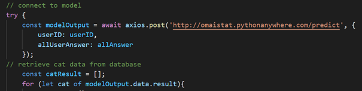

We faced a lot of time pressure as the backend track could not really start in the beginning as the whole setup of the website was not clear.

All in all, it was fun to find a solution for all the obstacles we were facing and to get rewarded with a code which is functioning. Also, the meetings with the other tracks were interesting as we got an insight of their work when we needed to create routes or connect endpoints. Most of our problems we were able to solve with the help of our TechLabs mentors, video tutorials, code snippets we found on the internet, tutorials on websites, meetings with the other track members and by just trying.

## Data Science ##

### Tech-Stack: ###

- Python (Sklearn, Numpy, Pandas, Seaborn, Matplotlib, Names)

- Jupyter Notebook

- Flask API

- JSON

- Postman

- Github

- Excel

- Visual Studio Code

In our Pet-Match project the data science team is responsible for sourcing and providing of a suitable data set, the cleaning of the entire data which will be needed as information basement for further decision-making/support as well as applying a proper machine learning methodology. To produce a good data science support, it is mandatory to exchange with all other disciplines from the very beginning in order to achieve a common goal and to deliver the final MVP.

Thus, the DS-Team spend much time to find a sufficient data set which has served as a solid database in order to extract information and rules from it throughout the entire project phase. We had a couple of attempts to find the "perfect" data set, which in the end does not exist. Finally, we as the whole team committed to take the "cats data set" for the entire duration of the project phase. Furthermore, we discussed extending the database with new data sets (other pets). The data set we used has approximately 3300 rows (data sets) and 105 columns (attributes). The very initial task was to clean and structure the data so that we could apply the very first rules to gain important information. For that, we cleaned the data in the columns which we saw as required to predict a satisfaction for the potential adopter in order to find any useful pattern. First we changed nominal data into numerical data, as seen below.

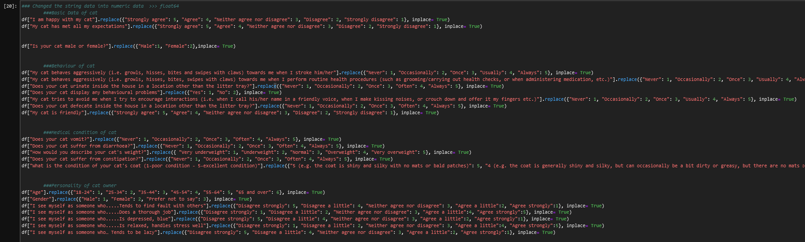

To find the first pattern, we decided on making a correlation analysis. For that we have chosen the columns which might influence the satisfaction of the adopter and tried to find out if there is any correlation. If there would be one or many, we must implement the context of the question of which is behind of the column in our questionnaire. We identified a couple of "slight" positive correlations that points out that there are at least small interrelationships.

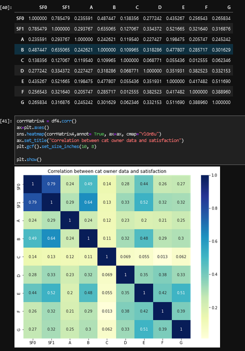

In between we were setting up a scoring system which serves our questionnaire to recommend a matching cat, added random cat names since the data set did not have it and did further clean.

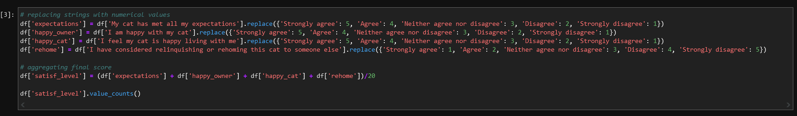

The DS-Team decided to go further and build up a reliable recommendation system which we will point out final cat recommendations whenever a potential adopter runs through the defined questionnaire. For that, we tried several approaches to find the right one for our project case. We did a regression analysis as well as a k-nearest neighbor attempt to figure out which will fits the best. By doing so, we faced a couple of roadblocks and obstacles. It turned out that a recommendation systems based on a correlation analysis fits the best for our data set and returns the best results.

Despite we tried a couple of machine learning methods (e.g. kNN, decision-tree etc.) to build a reliable recommender the DS-Team decided to focus on correlation based method because the initial results were more promising to the teammates. Nevertheless we also tried to use a "Jaccard-Similarity Method" as an alternative - which will be shown in detail further in the blog.
We started our correlation-based recommender by a with a deep brainstorming and discussion process to define what information is required and how we should conceptualize it, as below illustrated.

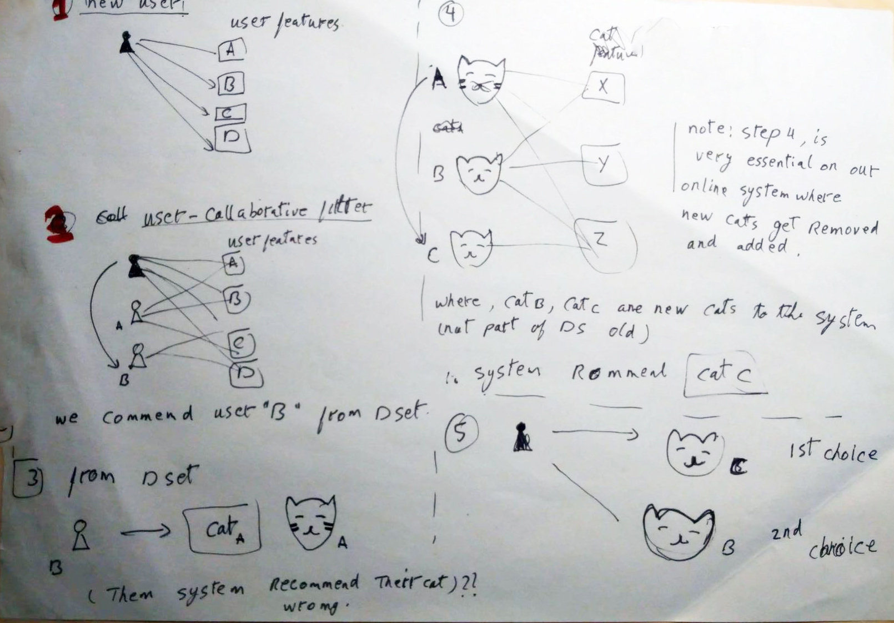

The final recommendation system which we used in our matchmaking requires two datasets. The first is the original dataset (offline dataset) which contains the adopters data as well as the cat data (recommender reference). The second dataset is basically a new subset of the original one which includes 40% of the original data (~ 953cats).

Afterwards the user inputs his data by using the online questionnaire - this is applied by using the Flask API.
The recommender applies the first cycle of matching to get the best matching user - based on a utility matrix table made from adopter's features only. The recommender extracts the best user's connected cat data from the offline dataset (first choice). After that the recommender applies the second cycle of matching to to get the best matching cats from the cats online dataset, which is based on a utility matrix table from the cat features only. Finally the recommender sorts the best results and gets the best 10, as shown by the illustration below.

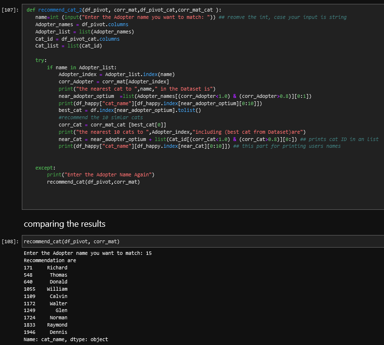

As mentioned before, we also tried the "Jaccard-Similarity Method". Jaccard similarity also called the jaccard index is a metric that measures the overlap between two sets of items, defined as the number of overlapping items found in both sets divided by the total number of unique items in either set. In this evaluation method, 3 different sets of connected cats were generated using correlation of 0.95 and 0.50 comparing with the use case of 0.8. What knowledge we can extract is that the model functions because there's a overlap in recommended cats, which is consistent with the real life situation.

All in all we achieved our goal to set up a reliable recommendation system, for which systematic we implemented a Flask API. That required close work with backend and we had to debug issues raised by the difference between Jupyter Notebook vs. Flask format, local vs. server implementation and incompatibilities of our output with backend. On the picture below, there is an example of input (users questionnaire) and output (recommended cats) from Postman.

## Conclusion

In conclusion, we need to say that we faced many roadblocks on our way to deliver a good product. We had two major drop-outs (UX) who left the team, but we did our best to compensate it.

But nevertheless it was a great time, we have learned a lot and our mentors supported us wherever they could. Finally, we need to highlight that our teamwork was great and we have used many tools to exchange or create files and information. Although GitHub was not easy to handle and as a tool to exchange information, a little too complex for beginners it worked out well in the end.
